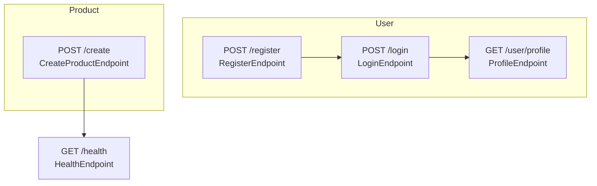

# EcommerceDemo

A full-stack e-commerce application with .NET backend and modern frontend.

## Project Structure

- **Backend**: .NET Web API
- **Frontend**: ReactJS TS
- **Database**: PostgreSQL

## Development Setup

### Prerequisites

- .NET 9.0 or later
- ReactJS TS
- PostgreSQL

### Backend Setup

1. Clone the repository
2. Navigate to the backend project directory
3. Set up user secrets for the project:

```bash
dotnet user-secrets init --id ecommercedemo
```

4. Configure JWT settings:

```bash
dotnet user-secrets set "Jwt:Secret" "your-super-secret-key-here"
dotnet user-secrets set "Jwt:Issuer" "ecommercedemo"
dotnet user-secrets set "Jwt:Audience" "ecommercedemo-users"
dotnet user-secrets set "Jwt:ExpiryMinutes" "60"
```

5. Configure database connection string:

```bash
dotnet user-secrets set "ConnectionStrings:postgres" "Host=localhost;Database=EcommerceDemo;Username=your_username;Password=your_password"
```

6. Run database migrations:

```bash
dotnet ef database update
```

7. Start the backend:

```bash
dotnet run
```

### Frontend Setup

1. Navigate to the frontend directory
2. Install dependencies:

```bash
npm install
```

3. Start the development server:

```bash
npm start
```

## API Documentation

The API documentation is available at `/swagger` when running in development mode.



## Contributing

1. Fork the repository
2. Create a feature branch
3. Make your changes
4. Submit a pull request
